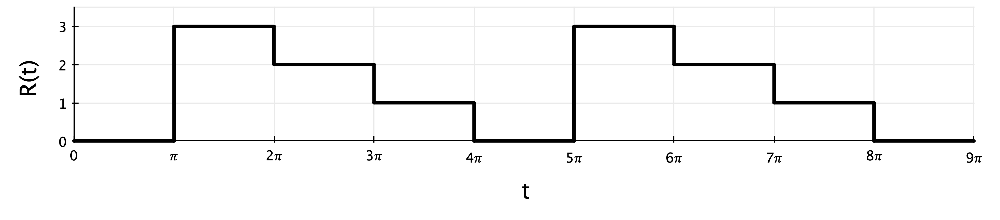

# Sample Quiz 2 problems: IVPs

## Problem 1: Stability analysis

Given the first-order ODE
\begin{equation}
\frac{dy}{dt} = -8y \;,
\end{equation}

a.) Perform a linear stability analysis to find the amplification factor ($\sigma$) for the **midpoint method** (also known as the modified Euler method) applied to this ODE.

**Solution:**
\begin{align}
y_{i+1/2} &= y_i + \frac{\Delta t}{2} \, f(t_i, y_i) \\
y_{i+1} &= y_i + \Delta t \, f(t_i + \frac{\Delta t}{2}, y_{i+1/2})
\end{align}

For this ODE:
\begin{align}
y_{i+1/2} &= y_i + \frac{\Delta t}{2} \, (-8 y_i) = y_i - 4 \Delta t \, y_i \\
y_{i+1} &= y_i + \Delta t \, \left( y_i - 4 \Delta t \, y_i \right) \\
&= y_i - 8 \Delta t \, y_i + 32 \Delta t^2 \, y_i \\
&= y_i (1 - 8 \Delta t + 32 \Delta t^2)
\end{align}
So, 
\begin{equation}
\sigma = \frac{y_{i+1}}{y_i} = 1 - 8 \Delta t + 32 \Delta t^2
\end{equation}

b.) Using your result from part (a), show whether the numerical solution would be stable or unstable for time-step sizes of $\Delta t = 0.2$ and $\Delta t = 0.4$. (Show for each value)

**Solution:** For stability, $|\sigma| \leq 1$.

$\Delta t = 0.2$:
\begin{equation}
\sigma = 1 - 8(0.2) + 32 (0.2)^2 = 0.68
\end{equation}
so **stable**.

$\Delta t = 0.4$:
\begin{equation}
\sigma = 1 - 8(0.4) + 32 (0.4)^2 = 2.92
\end{equation}
so **unstable**.

c.) Based on your results for parts (a) and (b), is the midpoint method unstable, conditionally stable, or unconditionally stable for this ODE?

**Solution:** Conditionally stable; the method is stable for some values of $\Delta t$ and unstable for other values.

d.) What is the order of accuracy for the midpoint method? Based on this, what (approximate) global errors would you expect in the solution when using time-step sizes of $\Delta t = 0.2$ and 0.4?

**Solution:** The midpoint method is 2nd-order accurate. So, for $\Delta t = 0.2$, we should expect global errors on the order of 0.04, and for $\Delta t = 0.4$ we should expect errors on the order of 0.16.

e.) What are your two options for reducing error in the solution?

**Solution:**

  - reduce the step size
  - choose a higher order method, such as 4th-order Runge-Kutta

## Problem 2: Second-order Backward Euler

Given the second-order ODE
\begin{equation}
2 y^{\prime\prime} + y^{\prime} + 4y = 3x
\end{equation}

a.) Find the recursion formulas (i.e., $y_{i+1} = \ldots$) for numerically solving this ODE using the backward Euler method. Clearly define/state any variable or function you use.

**Solution:**

System of Backward Euler recursion formulas, for $y(x)$ and $u(x) = y^{\prime}$, where $f(x,y,u) = dy/dx$ and $g(x,y,u) = du/dx = y^{\prime\prime}$:
\begin{align}
y_{i+1} &= y_i + \Delta x \, f(x_{i+1}, y_{i+1}, u_{i+1}) = y_i + \Delta x \, u_{i+1} \\
u_{i+1} &= u_i + \Delta x \, g(x_{i+1}, y_{i+1}, u_{i+1}) = u_i + \Delta x \, \left( \frac{3}{2}x_{i+1} - \frac{1}{2} u_{i+1} - 2 y_{i+1} \right)
\end{align}
This form is implicit and cannot be used directly, so we need to solve the system of equations.

*There are two ways to approach this, that give an equivalent solution*

**Option 1:** Use substitution and elimination to solve:
\begin{align}
u_{i+1} &= u_i + \frac{3}{2} \Delta x \, x_{i+1} - \frac{1}{2} \Delta x \, u_{i+1} - 2 \left( y_i + \Delta x \, u_{i+1} \right) \\
&= u_i + \frac{3}{2} \Delta x \, x_{i+1} - \frac{1}{2} \Delta x \, u_{i+1} - 2 y_i - 2 \Delta x \, u_{i+1} \\
u_{i+1} \left( 1 + 2 \Delta x^2 + \frac{1}{2} \Delta x \right) &= u_i + \frac{3}{2} \Delta x \, x_{i+1} - 2 \Delta x \, y_i
\end{align}
Thus,
\begin{align}
u_{i+1} &= \frac{u_i + \frac{3}{2} \Delta x \, x_{i+1} - 2 \Delta x \, y_i}{1 + 2 \Delta x^2 + \frac{1}{2} \Delta x} \\
y_{i+1} &= y_i + \Delta x \frac{u_i + \frac{3}{2} \Delta x \, x_{i+1} - 2 \Delta x \, y_i}{1 + 2 \Delta x^2 + \frac{1}{2} \Delta x}
\end{align}

**Option 2:** Or, use Cramer's rule:
\begin{align}
y_{i+1} - \Delta x u_{i+1} &= y_i \\
2 \Delta x \, y_{i+1} + \left( 1 + \frac{1}{2} \Delta x \right) u_{i+1} &= u_i + \frac{3}{2} \Delta x \, x_{i+1} \\
\rightarrow \begin{bmatrix} 1 & -\Delta x \\ 2 \Delta x & \left( 1 + \frac{1}{2} \Delta x \right)\end{bmatrix} \begin{bmatrix} y_{i+1} \\ u_{i+1} \end{bmatrix} &= 
\begin{bmatrix} y_i \\ u_i + \frac{3}{2} \Delta x \, x_{i+1} \end{bmatrix}
\end{align}
Then,
\begin{align}
y_{i+1} &= \frac{y_i \left(1 + \frac{\Delta x}{2} \right) + \Delta x \left( u_i + \frac{3}{2} \Delta x \, x_{i+1} \right)}{1 + \frac{\Delta x}{2} + 2 \Delta x^2} \\
u_{i+1} &= \frac{u_i + \frac{3}{2} \Delta x \, x_{i+1} - 2 \Delta x \, y_i}{1 + \frac{\Delta x}{2} + 2 \Delta x^2}
\end{align}

b.) What is the order of accuracy for the backward Euler method? Given a step size $\Delta x = 0.15$, approximately what local error and what global error would you expect in your solution? What is the difference between these two errors?

**Solution:**  Backward Euler is 1st-order accurate, so the global error is on the order of the step size ($\Delta x$).

The global error should then be on the order of 0.15, and the local error on the order of $0.15^2 = 0.0225$.

The differnce: the local (or truncation) error is the error at each step of the solution, while the global error is the overall error that accumulates over the whole solution.

c.) Why would you want to use this method to solve an ODE over a simpler method like forward Euler?

**Solution:** Backward Euler is unconditionally stable, while Forward Euler is conditionally stable.

## Problem 3: Fourier series

Given the input waveform $R(t)$ shown here,

a.) What is the period and fundamental frequency of the input forcing function?

**Solution:** 
\begin{equation}
T = 4\pi$ \quad $\omega = \frac{2\pi}{T} = \frac{1}{2}
\end{equation}

b.) Is the periodic function $R(t)$ odd, even, or neither?

**Solution:** Neither.

c.) Find the coefficients $a_0$ and $a_n$ of the Fourier series representation of $R(t)$. (For purposes of time, you do not need to find $b_n$):
\begin{equation}
R(t) = a_0 + \sum_{n=1}^{\infty} a_n \cos(n \omega t) + \sum_{n=1}^{\infty} b_n \sin(n \omega t) 
\end{equation}

**Solution:**
\begin{align}
a_0 &= \frac{1}{T} \int_0^T f(t) dt = \frac{1}{4\pi} \left[ \int_0^{\pi} 0 dt + \int_{\pi}^{2\pi} 3 dt + \int_{2\pi}^{3\pi} 2 dt + \int_{3\pi}^{4\pi} 1 dt  \right] \\
&= \frac{1}{4\pi} \left[ 3 \pi + 2 \pi + 1 \pi \right] \\
a_0 &= \frac{3}{2}
\end{align}

\begin{align}
a_n &= \frac{2}{T} \int_0^T f(t) \cos(n \omega t) dt \\
&= \frac{2}{4\pi} \left[ \int_0^{\pi} 0 \cos \left(\frac{n t}{2}\right) dt + \int_{\pi}^{2\pi} 3 \cos \left(\frac{n t}{2}\right) dt + \int_{2\pi}^{3\pi} 2 \cos \left(\frac{n t}{2}\right) dt + \int_{3\pi}^{4\pi} 1 \cos \left(\frac{n t}{2}\right) dt  \right] \\
&\cdots \\
a_n &= \frac{1}{n\pi} \left[ \sin\left(\frac{3 n \pi}{2}\right) - 3 \sin\left(\frac{n \pi}{2}\right) \right]
\end{align}

## Problem 4: Second-order analytical

The displacement $y(t)$ of a harmonically forced mass-spring system is given by:
\begin{equation}
y^{\prime\prime} + 8y^{\prime} + 16y = 6 e^{-4t}
\end{equation}

a.) For initial conditions $y(0)=0$ and $y^{\prime}(0) = 2$, find the response of the system $y(t)$.

**Solution:**

First, get the homogeneous solution:
\begin{align}
y_H^{\prime\prime} + 8y_H^{\prime} + 16y_H &= 0 \\
\rightarrow \lambda^2 + 8 \lambda + 16 &= 0 = (\lambda + 4)^2 \\
\lambda &= 4 \text{ (repeated)} \\
\text{so } y_H &= c_1 e^{-4t} + c_2 t e^{-4t}
\end{align}

Next, use the method of undetermined coefficients to get the inhomogeneous solution:
\begin{align}
y_{IH} &= K t^2 e^{-4t} \\
y_{IH}^{\prime} &= K e^{-4t} \left( 2t - 4t^2 \right) \\
y_{IH}^{\prime\prime} &= K e^{-4t} \left( -8t + 2 - 8t + 16t^2 \right) \\
\rightarrow K &= 3 
\end{align}

Then, the general solution is
\begin{equation}
y(t) = c_1 e^{-4t} + c_2 t e^{-4t} + 3 t^2 e^{-4t}
\end{equation}

Applying the initial conditions:
\begin{equation}
y(t) = 2 t e^{-4t} + 3 t^2 e^{-4t}
\end{equation}

b.) Given a specified time increment $\Delta t$ and a domain, write the recursion formulas for solving this equation with the forward Euler method. Clearly define any variables or functions used. You do not need to write Matlab code.

**Solution:** If $z_1 = y$ and $z_2 = y^{\prime}$, then
\begin{align}
z_1^{\prime} &= z_2 \\
z_2^{\prime} &= y^{\prime\prime} = 6e^{-4t} - 8z_2 - 16z_1 = f(t, z_1, z_2)
\end{align}

Then, the recursion formulas are:
\begin{align}
z_{1, i+1} &= z_{1,i} + \Delta t \, z_{2,i} \\
z_{2, i+1} &= z_{2, i} + \Delta t \left( 6 e^{-4t} - 8 z_{2,i} - 16 z_{1,i} \right)
\end{align}
where $z_{1,1} = 0$ and $z_{2,1} = 4$.
